<script type="text/javascript" src="http://cdn.mathjax.org/mathjax/latest/MathJax.js?config=TeX-AMS-MML_HTMLorMML"></script>
<script type="text/x-mathjax-config">
    MathJax.Hub.Config({ tex2jax: {inlineMath: [['$', '$']]}, messageStyle: "none" });
</script>

# Lecture Notes: Routing Problems

Please note that I am currently working on these notes and they are somewhat incomplete, missing images and some addition sections required.

They will form part of a larger book I intend to release next year which you will get access to at some point.

## Introduction
Routing problems are a class of optimisation problems concerned with finding the most efficient way to allocate and schedule resources to move goods, people, or information from one location to another. These problems are crucial in various industries such as transportation, logistics, supply chain management, and telecommunications. The goal is to minimise costs, time, or other relevant metrics while satisfying constraints such as capacity limitations, time windows, and demand fulfillment.

## Traveling Salesman Problem (TSP)
The Traveling Salesman Problem (TSP) is one of the most well-known routing problems. It involves finding the shortest possible tour that visits each city exactly once and returns to the original city. 

|||
|--|--|
|<center>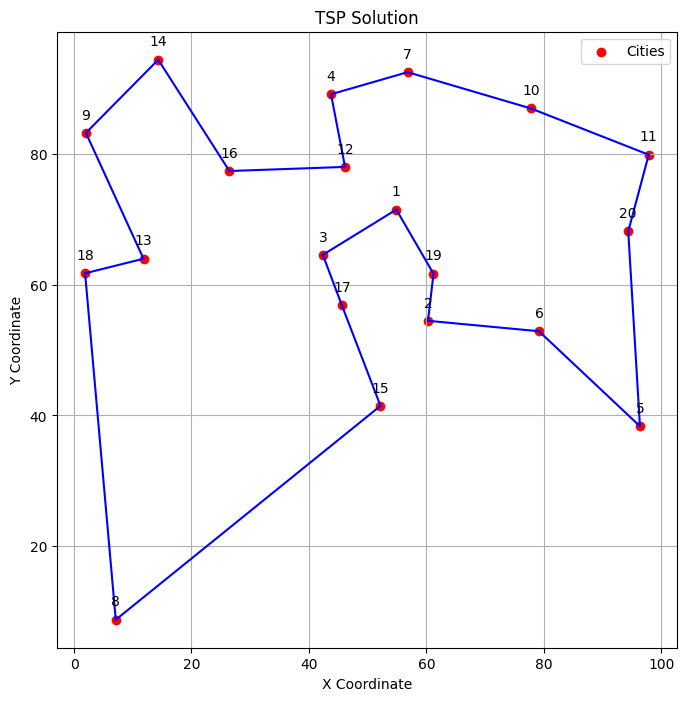</center>|<center>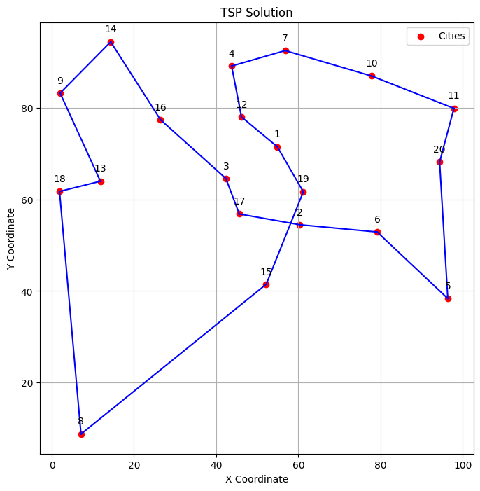</center>|
|<center>Optimal Tour</center>|<center>Suboptimal Tour</center>|

### Mathematical Formulation
Let:
- $n$ be the number of cities,
- $c_{ij}$ be the distance between cities $i$ and $j$,
- $x_{ij}$ be a binary decision variable indicating whether to travel directly from city $i$ to city $j$.

The objective is to minimise the total distance traveled:

$$
\text{Minimise} \quad \sum_{i=1}^{n}\sum_{j=1, j\neq i}^{n} c_{ij}x_{ij}
$$

Subject to:
1. Each city is left exactly once (one outgoing edge):

$$
\sum_{j=1, j\neq i}^{n} x_{ij} = 1, \quad \forall i \in \{1,2,...,n\}
$$

2. Each city is visited exactly once (one incoming edge):

$$
\sum_{i=1, i\neq j}^{n} x_{ij} = 1, \quad \forall j \in \{1,2,...,n\}
$$

3. No subtours:

$$
u_i - u_j + 1 \leq (n - 1)(1-x_{ij}), \quad \forall i \in \{2,3,...,n\}, j \in \{2,3,...,n\}, i \neq j
$$

Where $u_i$ is a continuous variable representing the position of city $i$ in the tour and $n$ is the number of cities.

We can write this compactly as follows.

$$
\begin{align*}
&\text{Minimise } \; &\sum_{i \in V}\sum_{j \in V:i \neq j } c_{ij}x_{ij} \\
&\text{Subject to: } \\
& \; & \sum_{j \in V:j\neq i} x_{ij} = 1, \quad &\forall i \in V & \text{dsad} \\
& \; & \sum_{i\in V:i\neq j} x_{ij} = 1, \quad & \forall j \in V & \text{dsad}\\
& \; & u_i - u_j + 1 \leq (n - 1)(1-x_{ij}), \quad & \forall i,j \in V \setminus \{1\}: i \neq j & \text{dsad}\\
& \; & x_{ij} \in \{0,1\}, \quad &  \forall i, j \in V : i \neq j\\
& \; & u_i \in \mathbb{R}, \quad &  \forall i \in V
\end{align*}
$$
Note that $V \setminus \{1\} = \{2,3,\dots n \}$. i.e. it is the set $V$ without element $1$.

### Implementation in Pyomo

Given the above model, this is readily implemented in Pyomo.

```python
from pyomo.environ import *

# Example usage
num_cities = 4
distance_matrix = {
    (1, 2): 10, (1, 3): 15, (1, 4): 20,
    (2, 1): 10, (2, 3): 35, (2, 4): 25,
    (3, 1): 15, (3, 2): 35, (3, 4): 30,
    (4, 1): 20, (4, 2): 25, (4, 3): 30
}

model = ConcreteModel()

# Set of nodes
model.V = RangeSet(1, num_cities)

# Binary decision variables: x[i,j] equals 1 if the TSP tour goes from node i to node j
model.x = Var(model.V, model.V, within=Binary, initialize=0)

# Continuous decision variables: u[i] represents the order of node i in the tour
model.u = Var(RangeSet(2, num_cities), within=Reals)

# Objective function: minimize total distance
model.obj = Objective(expr=sum(distance_matrix[i, j] * model.x[i, j] for i in model.V for j in model.V if i != j), sense=minimize)

# Constraints
def exactly_one_outgoing_edge_rule(model, i):
    return sum(model.x[i, j] for j in model.V if j != i) == 1

model.exactly_one_outgoing_edge = Constraint(model.V, rule=exactly_one_outgoing_edge_rule)

def exactly_one_incoming_edge_rule(model, i):
    return sum(model.x[j, i] for j in model.V if j != i) == 1

model.exactly_one_incoming_edge = Constraint(model.V, rule=exactly_one_incoming_edge_rule)

# This is to ensure that x[i,i]=0, it replaces the : i != j in the x_ij in {0,1} variable in the model
def no_self_edge_rule(model, i):
    return model.x[i, i] == 0
model.Vo_self_edge = Constraint(model.V, rule=no_self_edge_rule)

def mtz_subtour_elimination_rule(model, i, j):
    if i != j and j != 1 and i != 1:
        return model.u[i] - model.u[j] + 1 <= (num_cities - 1)*(1 - model.x[i,j])
    else:
        return Constraint.Skip
model.mtz_subtour_elimination = Constraint(model.V, model.V, rule=mtz_subtour_elimination_rule)

# Solve
solver = SolverFactory('glpk')
solver.solve(model)

# Print solution
print('Optimal Tour:')
for i in cities:
    for j in cities:
        if value(model.x[i, j]) == 1:
            print(f'{i} -> {j}')
```

If we run this code but add the following line before we solve

```python
# deactive the subtour constraint
model.mtz_subtour_elimination.deactivate()
```

We will see that we don't get a tour of all cities. We get a number of subtours.

|||
|--|--|
|<center>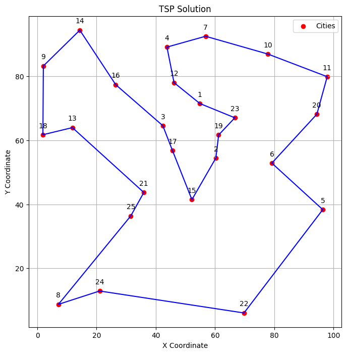</center>|<center>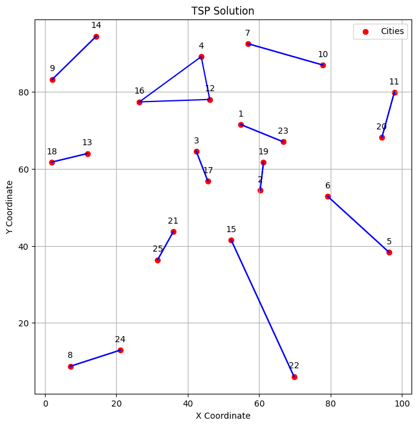</center>|
|<center>Complete Tour</center>|<center>Sub-tours</center>|

### Explaining the MTZ Subtour Constraint

We could have started with this, but I think it is nice to see it working and then to dive deeper into why this works.

The idea behind this constraint is that we wish to store the order of the tour in a variable $u_i \in \mathbb{R}$ where $u_i$ represents the order in which city $i$ is visited.

A key point here is that $u_i$ does not represent position. What we are looking for is some increasing sequence $u_{r_1} < u_{r_2} < \dots < u_{r_n}$, where $r_j$ is the represents where city $j$ is visited (position in the tour). e.g. $r_1=5, r_2=2$ states that the first city visited is $5$ and the second city visited is $2$.

We should consider what this means. If we have a city $i$ visited before city $j$, then we would expect to set $x_{ij}=1$. The above now requires that $u_j > u_i$, we can rewrite this as a constraint using $\geq$, namely $u_j \geq u_i + 1$. Basically, $u_j$ should be larger than $u_i$.

Thus,

$$
\begin{align*}
& \text{If } x_{ij}=1 \\
& \text{then } u_j \geq u_i + 1
\end{align*}
$$

We can represent this by using big $M$. That is a big enough number that means if $x_{ij}=0$, then the constraint is always satisfied (i.e. the constraint is not active).

$$
u_j + M(1-x_{ij}) \geq u_i + 1
$$

This can be rewritten as the form given in the mathematical program. 
$$
u_i - u_j + 1 \leq M(1-x_{ij})
$$

We will show shortly that we can set $M=n-1$.

When $x_{ij}=0$ then this constraint becomes $u_i - u_j + 1 \leq M$ and for large enough $M$ this is always satisfied, i.e. the constraint is effectively inactive. For a value of $x_{ij}=1$ this constraint becomes $u_i - u_j + 1 \leq 0$, which is exactly $u_j \geq u_i + 1$. 

Now we must consider the combinations of values of $i$ and $j$ that this constraint should be implemented. 

- This shouldn't be active for $i=j$, e.g. $x_{ii}$. 
- We also need to exclude this for the starting city. We fix this to be city 1 as it makes sense (remember a tour visits all cities and returns to the start. Any of the cities on a tour could be the starting point).

So why do we need to exclude the starting city. Let's first consider what happens if we don't exclude it.

We are free to choose a city to start with, we will refer to this as $r_1$. There must exist for $r_1$ a unique edge (one outgoing edge constraint) which joins it to the next city $r_2$, i.e. $x_{r_1r_2}=1$. Thus $u_{r_1} < u_{r_2}$ as the corresponding MTZ constraint is $u_{r_2} \geq u_{r_1} + 1$.  We then must have a unique edge which joins the next city $r_3$, thus $u_{r_2} < u_{r_3}$, this continues until we reach the $n$th city. We must have $r_1 \neq r_2 \neq \dots \neq r_n$ otherwise we would have had some sub tour in which some $r_j=r_k$. e.g. for a tour of 10 cities, the sub-tour $1,5,3,8,5,...$ has $r_2=r_5=5$. Then the following would be true:

$$
\begin{align*}
    u_{5} \geq u_{8} + 1 \\
    u_{8} \geq u_{5} + 1 
\end{align*}
$$

i.e. city 8 appears before city 5 and after city 5!

PLACEHOLDER IMAGE

Thus we have unique set of values for $r_i$ and the increasing sequence, 

$$
u_{r_1} < u_{r_2} < \dots < u_{r_n},
$$

However, this puts us in a bit of a predicament. For this to now be a complete tour we would need the following sequence.

$$
r_1, r_2, \dots, r_n, r_1
$$

That is we need to visit the starting city $r_1$ from our last city $r_n$. i.e. we need an edge $x_{r_nr_1}=1$.

This leads to the following two constraints needing to be satisfied simultaneously.

$$
\begin{align*}
    u_{r_n} \geq u_{r_1} + 1 \\
    u_{r_1} \geq u_{r_n} + 1 
\end{align*}
$$

This is impossible!

Thus we exclude city 1, so that we end up with an increasing sequence,

$$
u_{r_2} < u_{r_3} \dots < u_{r_n},
$$

but we are no longer bound by the MTZ constraint for city 1. Hence we are free to choose $x_{1r_2}=1$, that is city 1 starts the tour and connects with city $2$. We are also free to choose $x_{r_n1}=1$, city $n$ connects to city 1 to end the tour.

$$
1, r_2, \dots, r_n, 1
$$

Hence the full constraint is:

$$
u_i - u_j + 1 \leq M(1-x_{ij}), \quad  \forall i \in V \setminus \{1\}, j \in V \setminus \{1\}, i \neq j \\
$$

The last thing to explain is why $M=n-1$.

We need to simultaneously satisfy all the MTZ constraints for our values of $x_{ij}=1$, namely:

$$
\begin{align*}
    u_{r_2} - u_{r_3} + 1 \leq 0 \\
    u_{r_3} - u_{r_4} + 1 \leq 0 \\
    \vdots \\
    u_{r_{n-2}} - u_{r_{n-1}} + 1 \leq 0 \\
    u_{r_{n-1}} - u_{r_n} + 1 \leq 0
\end{align*}
$$

Adding all these constraints together we have $u_{r_2} - u_{r_n} + (n-2) \leq 0$. That is the difference between them must be at least $(n-2)$, i.e. $u_{r_n} - u_{r_2} \geq n-2$. 

Thus for the second city in the sequence $r_2$ and the last city in the sequence $r_n$ we have to satisfy both of the following constraints as $x_{r_2r_n}=0$ and $x_{r_nr_2}=0$ (i.e. there is no edge between them). Remember that $1$ is connected to both $r_2$ and $r_n$. Therefore:

$$
\begin{align*}
u_{r_2} - u_{r_n} + 1 \leq M \\
u_{r_n} - u_{r_2} + 1 \leq M \\
\end{align*}
$$

The first constraint is satisfied as long as $M\geq1$ as $u_{r_2} < u_{r_n}$ because of their position in the sequence. i.e. $u_{r_2} - u_{r_n} < 0$.

For the second $u_{r_n} - u_{r_2} \geq n-2 \implies u_{r_n} - u_{r_2} + 1 \geq n-1 \leq M$. 

Thus $M \geq n-1$, that is pick any number $M$ as long as it is greater than or equal to $n-1$.

## Extending the TSP to Allow Multiple Tours

Let's say we wish there to be $k$ tours leaving city 1. This is very easy. All we have to do is relax the incoming and outgoing edge constraints for city 1.

1. Each city is left exactly once. Now we exclude city 1:

$$
\sum_{j \in V:j \neq i} x_{ij} = 1, \quad \forall i \in \{2,...,n\}
$$

2. Each city is visited exactly once. Now we exclude city 1:

$$
\sum_{i \in V:i \neq j} x_{ij} = 1, \quad \forall j \in \{2,...,n\}
$$

3. The number of edges leaving the city 1 is equal the number of desired tours.

$$
\sum_{j \in V: j \neq 1} x_{1j} = m
$$

City 1 is now forced to have $m$ edges leaving and entering.

### Why Does This Work?

- The MTZ constraint now has other options than connecting city 1 at the beginning and end of the sequence. It can create many sub-chains of cities that are still valid for the constraints.

- It is then free to connect each of these chains of cities to city 1 to form a set of $m$ sub-tours.

This is really quite beautiful and gives you an intuition into the MTZ constraint itself!

You should consider what would happen if we don't use constraint 3. We will end up with a single tour, the TSP solution. Why? We discussed this previous in our discussion on the MTZ constraint. It also suggests a small optimisation in our TSP model.

## Vehicle Routing Problem (VRP)
The Vehicle Routing Problem (VRP) extends the TSP by introducing a fleet of vehicles with limited capacity to serve a set of customers with varying demands. The objective is to minimise the total distance traveled by the vehicles while satisfying all customer demands and respecting capacity constraints.

### Model 1
Let:
- $V$ be the set number of customers,
- $m$ be the number of vehicles,
- $q_i$ be the demand of customer $i$,
- $Q$ is the capacity of each vehicle
- $c_{ij}$ be the distance between customer $i$ and customer $j$,
- $x_{ij}$ be a binary decision variable indicating whether a vehicle travels from $i$ to $j$.
- Let $f_{ij}$ be the flow (amount carried by a vehicle) on the edge $i$ to $j$.

#### Minimise Total Distance
Objective:

$$
\text{Minimise} \quad \sum_{i \in V} \sum_{j \in V:j \neq i} c_{ij}x_{ij}
$$

Subject to:

1. Each city is left exactly once (excluding city 1):
 
$$
\sum_{j \in V:j \neq i} x_{ij} = 1, \quad \forall i \in V \setminus \{1\}
$$

2. Each city is visited exactly once (excluding city 1):

$$
\sum_{i \in V:i \neq j} x_{ij} = 1, \quad \forall j \in V \setminus \{1\}
$$

3. Vehicles leaving depot

$$
\sum_{j \in V} x_{1j} \leq m 
$$

4. Flow conservation maintained

$$
\sum_{j \in V} f_{ji} - \sum_{j \in V} f_{ij} = q_i, \quad \forall i \in V \setminus \{1\}
$$

5. Route capacity less than $Q$

$$
0 \leq f_{ij} \leq Qx_{ij}
$$


$$
x_{ij} \in \{0,1\}
$$

$$
f_{ij} \in \mathbb{R}
$$

To see why this works consider a sub-tour that does not include city 1. In this case, we have some tour $r_i, \dots r_p, r_i$ and therefore the following are required to be true simultaneously.

$$
\begin{align*}
    f_{r_ir_j} - f_{r_jr_k} = q_{r_j} & \quad \text{Flow conservation for $j$}\\
    f_{r_jr_k} - f_{r_kr_l} = q_{r_k} & \quad \text{Flow conservation for $k$}\\
    \vdots\\
    f_{r_pr_i} - f_{r_ir_j} = q_{r_i} & \quad \text{Flow conservation for $i$}\\
\end{align*}
$$

Adding all of these together results in:

$$
0 = q_{r_i} + q_{r_j} + \dots + q_{r_p}
$$

This means that we will only get sub-tours if there exists a sequence of cities whereby the sub-tour is a balanced demand cycle (i.e. the sum of the demands is $0$).

This is only possible if we allow $q_i < 0$ (negative), i.e. we are picking up something. Even if we allow this (and there is no reason why not, the model will still work) it is highly unlikely we will come across such a balanced sequence for a group of cities close enough for it to matter.

I have however cooked up an example that illustrates this, see the images below.

To prevent this you can include the MTZ sub-tour constraints, but my advice would be to solve it first without them and if needed add them into your model.

6. MTZ sub-tour constraint (add to model if needed):

$$
u_i - u_j + 1 \leq (n - 1)(1-x_{ij}), \quad \forall i,j \in V \setminus \{1\}: i \neq j 
$$

|||
|--|--|
|<center>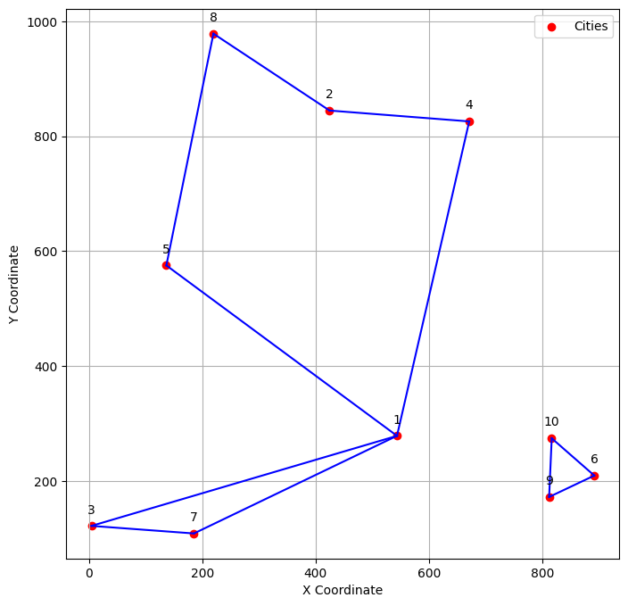</center>|<center>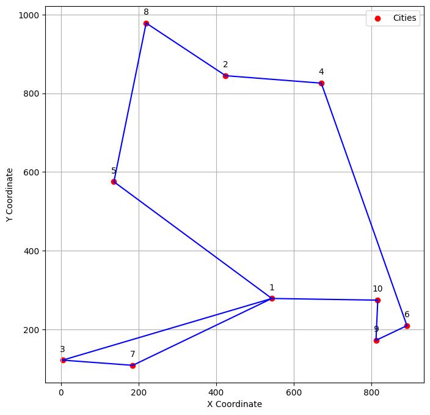</center>|
| <center>Without sub tour constraints</center> | <center>With sub tour constraints</center> |

### Implementation in Pyomo

```python
model = ConcreteModel()

# Set of nodes
model.V = RangeSet(1, num_cities)

# Set of vehicles
model.V = RangeSet(1, num_vehicles)

# Binary decision variables: x[i,j] equals 1 if the TSP tour goes from node i to node j
model.x = Var(model.V, model.V, within=Binary, initialize=0)

# Flow decision variables: f[i,j] equals 1 if the TSP tour goes from node i to node j
model.f = Var(model.V, model.V, within=NonNegativeReals, initialize=0)

# Objective function: minimize total distance
model.obj = Objective(expr=sum(distance_matrix[i, j] * model.x[i, j] for i in model.V for j in model.V if i != j), sense=minimize)

# Constraints
def exactly_one_outgoing_arc_rule(model, i):
    if i != 1:
        return sum(model.x[i, j] for j in model.V if j != i) == 1
    else:
        return Constraint.Skip

model.exactly_one_outgoing_arc = Constraint(model.V, rule=exactly_one_outgoing_arc_rule)

def exactly_one_incoming_arc_rule(model, i):
    if i != 1:
        return sum(model.x[j, i] for j in model.V if j != i) == 1
    else:
        return Constraint.Skip

model.exactly_one_incoming_arc = Constraint(model.V, rule=exactly_one_incoming_arc_rule)

def m_leave_depot_rule(model):
    return sum(model.x[1,i] for i in model.V) <= num_vehicles

model.m_leave_depot_rule = Constraint(rule=m_leave_depot_rule)

def flow_conservation_rule(model, i):
    if i != 1:
        incoming_flow = sum(model.f[j,i] for j in model.V)
        outgoing_flow = sum(model.f[i,j] for j in model.V)
        return incoming_flow - outgoing_flow == demand[i]
    else:
        return Constraint.Skip

model.flow_conservation = Constraint(model.V, rule=flow_conservation_rule)

# ensure flow is 0 if x[i,j]==0 and that all edges have flow less than capacity.
# combined with the flow_conservation, this ensures the largest edge is the edge leaving the depot, thus it is the load of the route.
def flow_capacity_rule(model, i, j):
    return model.f[i,j] <= capacity * model.x[i,j]

model.flow_capacity = Constraint(model.V, model.V, rule=flow_capacity_rule)

def mtz_subtour_elimination_rule(model, i, j):
    if i != j and j != 1 and i != 1:
        return model.u[i] - model.u[j] + 1 <= (num_cities - 1)*(1 - model.x[i,j])
    else:
        return Constraint.Skip
model.mtz_subtour_elimination = Constraint(model.V, model.V, rule=mtz_subtour_elimination_rule)
# deactivate the constraint
model.mtz_subtour_elimination.deactivate()

def print_solution(model):
    # Print solution
    print('Solution:')
    for i in model.V:
        for j in model.V:
            if value(model.x[i, j]) == 1:
                print(f'{i} -> {j}')

# Solve
solver = SolverFactory('glpk')
solver.solve(model)
print_solution(model)

# activate constraint and solve
model.mtz_subtour_elimination.activate()
solver.solve(model)
print_solution(model)
```

#### Some Key Points
* We require $Qm \geq \sum_{i \in V:i\neq 1} q_i$. i.e. we need enough vehicles to cover the demand.
* If we set $q_i = 1$ for all $i:i\neq1$ then this model means all locations are visited.
* Allowing $q_i \in \mathbb{R}$ then we can have negative demands (supply) and positive demands (demand).
  * You should recognise this from the multi-commodity flow Problem (MCFP).

#### The Main Issue with this Model

* We are minimising the total distance, thus we will select a route to be as large as the capacity of a van. You should think why this is the case.
  * In the extreme case if the capacity is large enough we will select a single vehicle and get the TSP solution 

This is problematic as most logistics companies would probably want to deliver as quickly as possible!

### Model 2

We will extend our model to now attempt to solve the following objective.

* Deliver all orders as quickly as possible

We can reframe this objective as minimising the maximum route length of any vehicle. This is known as a minimax formulation.

To do this we will need to know the length of each of the routes for the vehicles, to do this we will introduce another dimension to the problem to represent each vehicle $k$.

A nice way to visualise this idea is to imagine we are creating a copy of the network for each vehicle, we can then track which edges are used in each of the networks.

PLACEHOLDER IMAGE

Let:
- $V$ be the set of customers,
- $K$ be the set of vehicles,
- $q_i$ be the demand of customer $i$,
- $Q$ is the capacity of each vehicle
- $c_{ij}$ be the distance between customer $i$ and customer $j$,
- $x_{ijk}$ be a binary decision variable indicating whether vehicle $k$ travels from $i$ to $j$.
- Let $f_{ijk}$ be the flow (amount carried by vehicle) on the edge $i$ to $j$ for vehicle $k$.

$$
\begin{align*}
&\text{Minimise: } \; &C_{Max} \\
&\text{Subject to: } \quad \quad \\
 & \; &\sum_{k \in K} \sum_{j \in V:j\neq i} x_{ijk} = 1, \quad &\forall i \in V \setminus \{1\} & \text{A single vehicle enters a location}  \\
 & \; &\sum_{k \in K} \sum_{i\in V:i\neq j} x_{ijk} = 1, \quad &\forall j \in V \setminus \{1\}  & \text{A single vehicle leaves a location} \\
 & \; &\sum_{k \in K} \sum_{j \in V} x_{1jk} \leq m & & \text{No more than $m$ vehicles leave the depot} \\
 & \; &\sum_{i\in V} \sum_{j\in V:i\neq j} c_{ij}x_{ijk} \leq C_{Max}, \quad &\forall k \in K  & \text{Distance of route for a vehicle is less than $Q_{max}$} \\
 & \; &\sum_{k \in K} \sum_{j \in V} f_{jik} - \sum_{k \in K} \sum_{j \in V} f_{ijk} = q_i, \quad & \forall i \in V \setminus \{1\}  & \text{Enough demand is delivered to a location} \\
 & \; &0 \leq f_{ijk} \leq Qx_{ijk}, \quad &\forall i,j \in V, \forall k \in K : i \neq j & \text{Length of a route is less than vehicle capacity}\\
 & \; &x_{ijk} \in \{0,1\}, \quad &\forall i,j \in V, \forall k \in K : i \neq j\\
 & \; &f_{ijk} \in \mathbb{R}, \quad &\forall i,j \in V, \forall k \in K : i \neq j
\end{align*}
$$
Optional: Sub tour constraints.

Include if solving without results in sub tours not starting at city 1
$$
\begin{align*}
 & \; &u_{ik} - u_{jk} + 1 \leq (n - 1)(1-x_{ijk}), \quad & \forall i,j \in V \setminus \{1\}, \forall k \in K: i \neq j \quad & \text{MTZ Sub-tour constraint for each vehicle $k$}\\
 & \; &\sum_{j \in V:j\neq i} x_{jik} = \sum_{j \in V:j\neq i} x_{ijk}, \quad &\forall i \in V \setminus \{1\}, \forall k \in K \quad & \text{If vehicle $k$ enters location $i$ then it must leave location $i$} 
\end{align*}
$$


Again, it is best to solve this without the sub-tour constraints and only bring them into the model should a sub-tour present itself.

|||
|--|--|
| 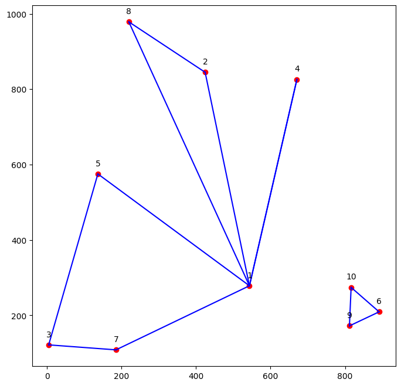 | 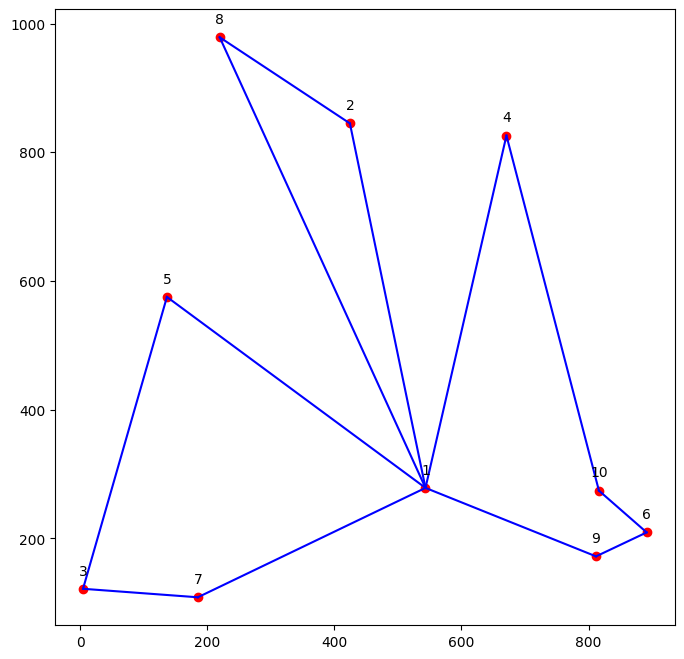 |
| <center>Without sub tour constraints</center> | <center>With sub tour constraints</center> |

For the solution without a separate sub-tour that doesn't include location 1 (image on the right), we can also plot each of the vehicles used to demonstrate that each does indeed have a complete sub-tour.

||||
|--|--|--|
| 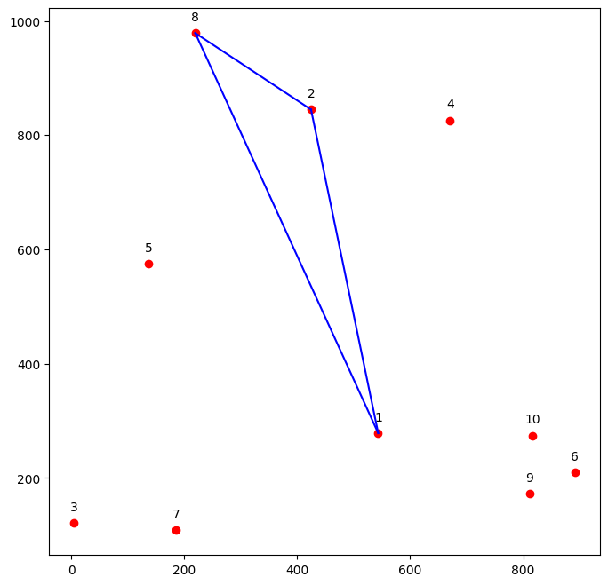 | 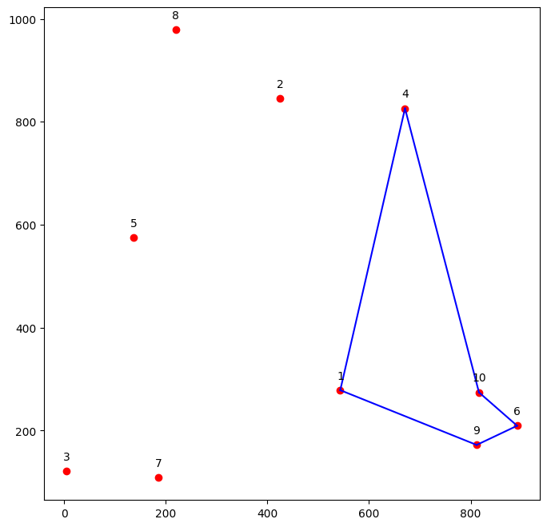 | 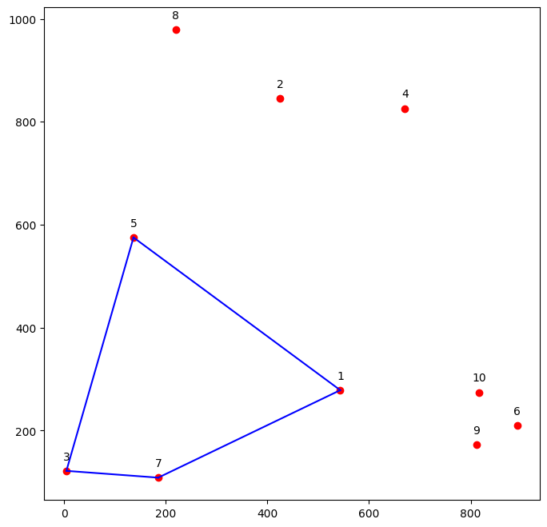 | 
||||

### Implementation in Pyomo

```python
model = ConcreteModel()

# Set of nodes
model.V = RangeSet(1, num_cities)

# Set of vehicles
model.K = RangeSet(1, num_vehicles)

# Binary decision variables: x[i,j] equals 1 if the TSP tour goes from node i to node j
model.x = Var(model.V, model.V, model.K, within=Binary, initialize=0)

# Flow decision variables: f[i,j] equals 1 if the TSP tour goes from node i to node j
model.f = Var(model.V, model.V, model.K, within=NonNegativeReals, initialize=0)

model.Cmax = Var(within=NonNegativeReals)

# Objective function: minimize longest route for a vehicle
model.obj = Objective(expr=model.Qmax, sense=minimize)

# Constraints
def exactly_one_outgoing_arc_rule(model, i):
  if i != 1:
    return sum(model.x[i, j, k] for k in model.K for j in model.V if j != i) == 1
  else:
    return Constraint.Skip

model.exactly_one_outgoing_arc = Constraint(model.V, rule=exactly_one_outgoing_arc_rule)

def exactly_one_incoming_arc_rule(model, i):
  if i != 1:
    return sum(model.x[j, i, k] for k in model.K for j in model.V if j != i) == 1
  else:
    return Constraint.Skip

model.exactly_one_incoming_arc = Constraint(model.V, rule=exactly_one_incoming_arc_rule)

def m_leave_depot_rule(model):
  return sum(model.x[1,i,k] for k in model.K for i in model.V) <= num_vehicles

model.m_leave_depot_rule = Constraint(rule=m_leave_depot_rule)

def route_length_rule(model, k):
    return sum(model.c[i,j] * model.x[i,j,k] for i in model.V for j in model.V if i!= j) <= model.Cmax
  
model.route_length = Constraint(model.K, rule=route_length_rule)
    
def flow_conservation_rule(model, i):
  if i != 1:
    incoming_flow = sum(model.f[j,i,k] for k in model.K for j in model.V if i!= j)
    outgoing_flow = sum(model.f[i,j,k] for k in model.K for j in model.V if i!= j)
    return incoming_flow - outgoing_flow == demand[i]
  else:
    return Constraint.Skip

model.flow_conservation = Constraint(model.V, rule=flow_conservation_rule)

# ensure flow is 0 if x[i,j]==0 and that all edges have flow less than capacity.
# combined with the flow_conservation, this ensures the largest edge is the edge leaving the depot, thus it is the load of the route.
def flow_capacity_rule(model, i, j, k):
  return model.f[i,j,k] <= capacity * model.x[i,j,k]

model.flow_capacity = Constraint(model.V, model.V, model.K, rule=flow_capacity_rule)

def mtz_subtour_elimination_rule(model, i, j, k):
    if i != j and j != 1 and i != 1:
        return model.u[i,k] - model.u[j,k] + 1 <= (num_cities - 1)*(1 - model.x[i,j,k])
    else:
        return Constraint.Skip
model.mtz_subtour_elimination = Constraint(model.V, model.V, model.K, rule=mtz_subtour_elimination_rule)

def arc_in_out_vehicle_rule(model, i, k):
  if i != 1:
    incoming_flow = sum(model.x[j,i,k] for j in model.V if i!= j)
    outgoing_flow = sum(model.x[i,j,k] for j in model.V if i!= j)
    return incoming_flow - outgoing_flow == 0 
  else:
    return Constraint.Skip

model.arc_in_out_vehicle_rule = Constraint(model.V, model.K, rule=arc_in_out_vehicle_rule)
```

### Limitations of the Model

We assume only a single vehicle can visit a location. What if the demand at a location is greater than the vehicle capacity?

We could remove the constraints that state a single vehicle enters and a single vehicle leaves a given location. However, this makes the search space much larger. 

We also could consider the following:

* Vehicle battery limit (if we are using electric vehicles)
* Different capacities for vehicles
* Time windows for deliveries
* Weight limit for a vehicle
* Different sized deliveries/pickups (i.e. hetrogeneous demand/supply)

Modelling any of these makes this problem even more difficult. However, it is something that is modelled and solved everyday by thousands, if not millions of companies. Some use sophisticated software, others may do it by hand. 

## NP-Hard Problems and Heuristic Solutions
Both TSP and VRP are NP-Hard problems, meaning that no known polynomial-time algorithm can solve them optimally. Therefore, heuristic methods are commonly employed to find near-optimal solutions in a reasonable amount of time. Some popular heuristics include:
- Nearest Neighbor
- Clarke-Wright Savings Algorithm
- Simulated Annealing
- Genetic Algorithms

### Nearest Neighbour Algorithm

We can think about this as a game in which the players are the vehicles. 

Here is a basic algorithm.

Each vehicle starts at the depot.

```
For each vehicle:
    While vehicle has capacity
        Move to the nearest location where demand is smaller than capacity
        
    return to start location
```

Note that this processes each vehicle in turn.

#### Big Issue

* We can end up picking up demand that is far away.

#### Solution

We can set some max distance from the depot.


## Conclusion
Routing problems are fundamental in operations research and have significant real-world applications. While optimal solutions may be elusive due to their NP-Hard nature, heuristic approaches such as simulated annealing offer practical means of finding near-optimal solutions. Understanding and effectively solving routing problems are crucial for efficient resource allocation and logistics management in various industries.
