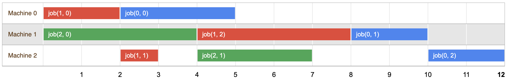
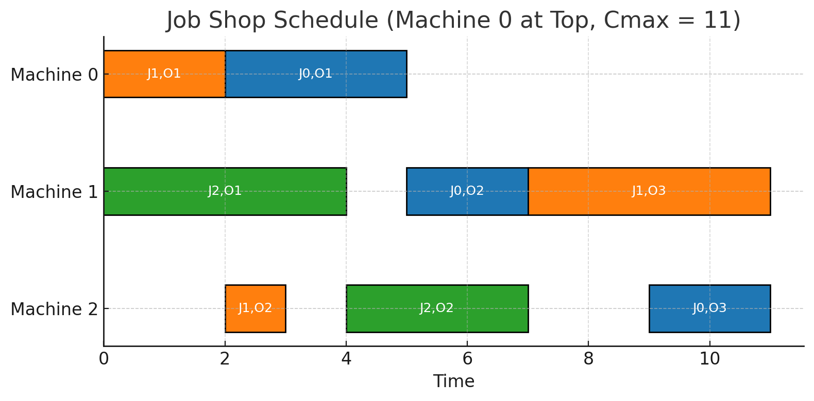

<script type="text/javascript" src="http://cdn.mathjax.org/mathjax/latest/MathJax.js?config=TeX-AMS-MML_HTMLorMML"></script>

<script type="text/javascript"
src="http://cdn.mathjax.org/mathjax/latest/MathJax.js?config=TeX-AMS-MML_HTMLorMML">
</script>

<script type="text/x-mathjax-config">
      MathJax.Hub.Config({
        tex2jax: { 
         inlineMath: [ ['$','$'], ["\\(","\\)"] ],
         displayMath: [ ['$$','$$'], ["\\[","\\]"] ],
         processEscapes: false,
        }
      });
</script>
    
# Job Shop Scheduling

These notes are based off the excellent resources provided by [Google OR-Tools](https://developers.google.com/optimization/cp).

## 1. Constraint Programming

### Constraint Satisfaction Problem (CSP)

The Constraint Satisfaction Problem (CSP) is defined by:
- a set of variables $X = \{x_1, x_2, \ldots, x_n\} $
- each with a domain $D=\{d_1,d_2,\dots,d_n\}$ of possible values
- and a set of constraints $C = \{c_1, c_2, \ldots, c_m\}$
    - where each constraint $c_i=(S_i, R_i)$ involves a subset of variables, $S_i=(x_{i_1}, x_{i_2}, \ldots, x_{i_k})$ (scope), and specifies the allowable combinations of values for those variables $R\subseteq d_{i_1} \times \dots \times d_{i_k}$(relation).

The goal is to find an assignment of values to the variables from their respective domains such that all constraints are satisfied simultaneously.

Formally, a solution to the CSP is an assignment $A= \{x_1 = v_1, x_2 = v_2, \ldots, x_n = v_n\}$ such that:
- Each variable $x_i$ is assigned a value $v_i$ from its domain $D_i$.
- For each constraint $c_i$ involving variables $(x_{i_1}, x_{i_2}, \ldots, x_{i_k})$, the combination of values $(v_{i_1}, v_{i_2}, \ldots, v_{i_k})$ satisfies the constraint $C_i$.

The CSP can be represented as a tuple $\langle X, D, C \rangle$, where:
- $X$ is the set of variables.
- $D = \{d_1, d_2, \ldots, d_n\}$ is the set of domains for the variables.
- $C$ is the set of constraints.

**Note**: *An objective is optional*. For example, sudoku is a CSP and has no objective! You just need to find a solution that satisfies the constraints

### Example Constraint

Consider the constraint:

$$\begin{align*}
x+y&=z \\
x,y,z &\in \{0,1\}
\end{align*}$$

Then the constraint is given by $c=((x,y,z),\{(0,0,0),(1,0,1),(0,1,1)\})$

<div style="page-break-after:always"></div>

### Example problem

$$
\begin{align*}
\text{maximise } & \; &2x + 2y + 3z \\
\text{subject to: } & \; & 3x -5y + 7z \leq 45 \\
& \; & 2y -6z \leq 37 \\
& \; & x,y,z \geq 0 \\
& \; & x,y,z \in \mathbb{Z}
\end{align*}
$$


You will also recognise this as an integer programming problem. 

You already know how to solve this using Pyomo!

You can also see how to solve this using [Google OR-Tools CP-SAT solver](https://developers.google.com/optimization/cp/cp_example). Note that this is a different technique and solver to the one we've been using in Pyomo (GLPK).

### Constraint Programming vs Mathematical Programming


You should look at the following to see the differences - [IBM Decision Optimisation - MP vs CP](https://ibmdecisionoptimization.github.io/docplex-doc/mp_vs_cp.html).

Perhaps the most fundamental difference is this:

|| Linear (MILP/Integer) Programming | Quadratic Programming | Constraint Programming |
|--|--|--|--|
|Modelling Limitations | Restricted to linear problems |Restricted to quadratic problems | Restricted to discrete problems  |

<div style="page-break-after:always"></div>

## 2. Cryptarithmetic

A cryptarithmetic puzzle is a mathematical exercise where:
- The digits of some numbers are represented by letters (or symbols). 
- Each letter represents a unique digit. 
- The goal is to find the digits such that a given mathematical equation is verified

```
      OR
+     IS
+    FUN
--------
=   TRUE
```

This has 96 possible solutions. You should confirm that the two below are solutions!

```
      20
+     75
+    948
--------
=   1043
```


```
      60
+     37
+    928
--------
=   1025
```

### Converting to a CSP Model

**Variables**

- Based on the equation ``OR + IS + FUN = TRUE`` there are 8 variables. 
- The domain of each variable is $\{0,1,\dots, 9\}$.

**Constraints**:
- ``OR + IS + FUN = TRUE``
- Each of the 8 letters is unique. Note this is called the all different constraint
- ``O``, ``I``, ``F`` and ``T`` cannot be ``0`` (as we don't start numbers in decimal with a leading ``0``).

**Note**: There is no objective!

### Solution

You can find the how to implement the solution to a similar problem on the [Google OR-Tools site](https://developers.google.com/optimization/cp/cryptarithmetic).

## 3. What is Job Shop Scheduling

It is quite common in manufacturing to have machines that perform a given operation for a range of products. 

A complete job may have a sequence of operations that require the use of different machines, each with their own processing time. 

Below we have 3 jobs and 3 machines. Each job requires a sequence of operations using the machines.

|Jobs|Operations|Sequence on Machines|Process Time on Machines|
|--|--|--|--|
| $J_0$ | $O_{01}$, $O_{02}$, $O_{03}$ | $M_0$, $M_1$, $M_2$ | $3$,$2$,$2$ |
| $J_1$ | $O_{11}$, $O_{12}$, $O_{13}$ | $M_0$, $M_2$, $M_1$ | $2$,$1$,$4$ |
| $J_2$ | $O_{21}$, $O_{22}$ | $M_1$, $M_2$ | $4$,$3$ |

Here is an example schedule which is valid. 




***The question is how do we best schedule these jobs on the machines?***

Note that we can also express this problem as, 

```
Job 0 = [(0, 3), (1, 2), (2, 2)]
Job 1 = [(0, 2), (2, 1), (1, 4)]
Job 2 = [(1, 4), (2, 3)]
```

here the tuple of the form ``(m,p)`` represents:
- ``m = machine number``
- ``p = processing time on m``.

This is useful when writing code to solve these problems.

<div style="page-break-after:always"></div>

### History

1. **Early Development (1950s-1960s):**
   - The job shop scheduling problem emerged in the context of manufacturing operations during the 1950s and 1960s.
   - Researchers began formalizing scheduling problems and exploring mathematical approaches to solve them.

2. **Algorithmic Development (1970s-1980s):**
   - In the 1970s and 1980s, significant progress was made in developing algorithms to solve job shop scheduling problems.
   - Branch and bound algorithms were explored, along with mathematical programming techniques such as linear and integer programming.

3. **Heuristic Methods (1980s-Present):**
   - From the 1980s onwards, heuristic methods gained popularity for solving job shop scheduling problems.
   - Heuristic algorithms, including genetic algorithms, simulated annealing, tabu search, and ant colony optimization, were developed to find approximate solutions efficiently.

4. **Exact Algorithms (1990s-Present):**
   - In the 1990s and continuing into the present, research focused on developing exact algorithms for job shop scheduling.
   - Exact methods, such as branch and bound with dynamic programming and constraint programming, aim to find optimal solutions by exhaustively searching through all possible schedules.

5. **Hybrid Approaches and Applications (Present):**
   - Current research in job shop scheduling emphasizes hybrid approaches that combine different algorithms and techniques to improve solution quality and computational efficiency.
   - Job shop scheduling has widespread applications across various industries, including manufacturing, transportation, healthcare, and services, where efficient resource scheduling is crucial for optimizing productivity and minimising costs.

<div style="page-break-after:always"></div>

### Formal Definition

The job shop scheduling problem involves scheduling a set of $n$ jobs on a set of $m$ machines. 
- Each job consists of a fixed sequence of operations
- Each operation must be processed on a specific machine. 
- The **goal** is to determine the **optimal schedule** for executing these predetermined sequences of operations on the available machines in order to **minimise the makespan**.
---

#### Given
- A set of jobs $J = \{1, 2, \dots, n\}$
- A set of machines $M = \{1, 2, \dots, m\}$
- Each job $i \in J$ consists of a sequence of operations
  $$
  O_{i1}, O_{i2}, \dots, O_{i n_i}
  $$
  where operation $O_{ij}$ must be processed:
  - on a specific machine $m(i,j) \in M$,
  - for a known processing time $p_{ij} > 0$.

---

#### Decision Variables
- $S_{ij}$: start time of operation $O_{ij}$ (job $i$, operation $j$)
- $C_{\max}$: makespan, the time at which the final operation finishes

---

#### Constraints

1. **Precedence (Job Order)**  
   Each operation in a job must start only after the previous one finishes:
   $$
   S_{ij} + p_{ij} \le S_{i,j+1}
   \quad \forall i \in J, \; j = 1, \dots, n_i - 1
   $$
   This ensures that the sequence of operations within each job is maintained.

2. **No Overlap (Machine Capacity)**  
   For any two distinct operations $(i,j)$ and $(k,l)$ that require the same machine,
   one must finish before the other starts:
   $$
   S_{ij} + p_{ij} \le S_{kl}
   \quad \text{or} \quad
   S_{kl} + p_{kl} \le S_{ij},
   \quad \forall (i,j) \neq (k,l) : m(i,j) = m(k,l)
   $$
   This ensures that each machine can process at most one operation at any given time.

3. **Makespan Definition**  
   The makespan must be at least as large as the completion time of every operation:
   $$
   C_{\max} \ge S_{ij} + p_{ij}
   \quad \forall i \in J, \; j = 1, \dots, n_i
   $$

---

#### Objective
$$
\min C_{\max}
$$
That is, minimise the total time required to complete all jobs.

### Solving with a Sat Solver

You can find out how to solve this via [Google OR-Tools](https://developers.google.com/optimization/scheduling/job_shop)

### Solving as an LP

### Job Shop Scheduling MILP (concise)

**Sets**
- Jobs: $J=\{1,\dots,n\}$
- Machines: $M=\{1,\dots,m\}$
- Each job $i$ has operations $j=1,\dots,n_i$

**Data**
- $m(i,j)\in M$: machine required by operation $(i,j)$
- $p_{ij}>0$: processing time of $(i,j)$
- $H$: big-$M$ (e.g., $H=\sum_{i}\sum_{j}p_{ij}$)

**Decision variables**
- $S_{ij}\ge0$: start time of operation $(i,j)$
- $C_{\max}\ge0$: makespan
- $y_{ij,kl}\in\{0,1\}$: ordering of operations $(i,j)$ and $(k,l)$ **only for pairs with**
  $m(i,j)=m(k,l)$ **and a canonical index choice** $(i,j)<(k,l)$

**Objective**
$$
\min C_{\max}
$$

**Constraints**

1. *Precedence (within jobs - the sequence of operations is maintained with no overlap)*  
$$
S_{ij}+p_{ij}\le S_{i,j+1}
\qquad \forall i\in J,\; j=1,\dots,n_i-1
$$

2. *Machine no-overlap (pairwise on same machine - all operations from all jobs on a given machine must not overlap)*  
$$
\begin{aligned}
S_{ij}+p_{ij}&\le S_{kl}+H(1-y_{ij,kl})\\
S_{kl}+p_{kl}&\le S_{ij}+Hy_{ij,kl}
\end{aligned}
\qquad
\forall (i,j)<(k,l)\text{ s.t. }m(i,j)=m(k,l)
$$

3. *Makespan definition*  
$$
S_{ij}+p_{ij}\le C_{\max}
\qquad \forall i\in J,\; j=1,\dots,n_i
$$

4. *Domains*  
$$
S_{ij}\ge0,\quad C_{\max}\ge0,\quad y_{ij,kl}\in\{0,1\}
$$

### Pyomo Code

```python
from pyomo.environ import *

# === Job Shop Scheduling (MILP) for the example in the screenshot ===
# Each job i has a sequence of operations j = 1..n_ops[i].
# Each operation (i,j) must run on machine m[(i,j)] for p[(i,j)] time units.

model = ConcreteModel()

# -------------------------------------------------------
# Example data from screenshot (jobs start at 0, machines at 0)
# job 0 = [(0, 3), (1, 2), (2, 2)]
# job 1 = [(0, 2), (2, 1), (1, 4)]
# job 2 = [(1, 4), (2, 3)]
# -------------------------------------------------------

model.JOBS = Set(initialize=[0, 1, 2])
model.MACHINES = Set(initialize=[0, 1, 2])

# Number of operations in each job
n_ops = {0: 3, 1: 3, 2: 2}

# Map (i,j) -> (machine, processing_time) as in the screenshot
ops_data = {
    0: [(0, 3), (1, 2), (2, 2)],
    1: [(0, 2), (2, 1), (1, 4)],
    2: [(1, 4), (2, 3)],
}

# Build p[(i,j)] and m[(i,j)] from ops_data
p = {}
m = {}
for i in model.JOBS:
    for j, (mach, dur) in enumerate(ops_data[i], start=1):
        p[(i, j)] = dur
        m[(i, j)] = mach
        # Examples:
        #  p[(0,1)] = 3  -> job 0 op 1 takes 3 units
        #  m[(0,1)] = 0  -> job 0 op 1 must run on machine 0

# -------------------------------------------------------
# Sets of operations and conflict pairs
# -------------------------------------------------------

# All operations (i,j): for each job i, j = 1..n_ops[i]
model.OPS = Set(initialize=[(i, j) for i in model.JOBS for j in range(1, n_ops[i] + 1)])

# Build pairs of operations that use the same machine (potential overlap).
# Only once per unordered pair using the rule (i,j) < (k,l) (lexicographic).
pairs = []
for (i, j) in model.OPS:
    for (k, l) in model.OPS:
        if (i < k) or (i == k and j < l):
            if m[(i, j)] == m[(k, l)]:
                pairs.append((i, j, k, l))
model.PAIRS = Set(dimen=4, initialize=pairs)

# Big-M bound: safe (sum of all processing times)
H = sum(p.values())

# -------------------------------------------------------
# Decision Variables
# -------------------------------------------------------

model.S = Var(model.OPS, domain=NonNegativeReals)   # start time S[i,j]
model.Cmax = Var(domain=NonNegativeReals)           # makespan
model.y = Var(model.PAIRS, domain=Binary)           # ordering y[i,j,k,l] for shared-machine pairs

# -------------------------------------------------------
# Objective: minimize makespan
# -------------------------------------------------------

model.obj = Objective(expr=model.Cmax, sense=minimize)

# -------------------------------------------------------
# Constraints
# -------------------------------------------------------

# 1) Precedence within each job: S[i,j] + p[i,j] <= S[i,j+1]
def precedence_rule(model, i, j):
    if j < n_ops[i]:
        return model.S[i, j] + p[i, j] <= model.S[i, j + 1]
    return Constraint.Skip
model.Precedence = Constraint(model.OPS, rule=precedence_rule)

# 2) No-overlap on the same machine (pairwise, big-M with y)
def no_overlap_1(model, i, j, k, l):
    # If y=1 → (i,j) before (k,l)
    return model.S[i, j] + p[i, j] <= model.S[k, l] + H * (1 - model.y[i, j, k, l])

def no_overlap_2(model, i, j, k, l):
    # If y=0 → (k,l) before (i,j)
    return model.S[k, l] + p[k, l] <= model.S[i, j] + H * model.y[i, j, k, l]

model.NoOverlap1 = Constraint(model.PAIRS, rule=no_overlap_1)
model.NoOverlap2 = Constraint(model.PAIRS, rule=no_overlap_2)

# 3) Makespan: S[i,j] + p[i,j] <= Cmax
def makespan_rule(model, i, j):
    return model.S[i, j] + p[i, j] <= model.Cmax
model.Makespan = Constraint(model.OPS, rule=makespan_rule)

# -------------------------------------------------------
# Solve and pretty-print results
# -------------------------------------------------------
if __name__ == "__main__":
    from pyomo.opt import SolverFactory

    # Try a few common MILP solvers (use the first available)
    for solver_name in ["cbc", "glpk", "gurobi", "cplex"]:
        if SolverFactory(solver_name).available():
            opt = SolverFactory(solver_name)
            break
    else:
        raise RuntimeError(
            "No MILP solver found. Please install CBC (recommended), GLPK, Gurobi, or CPLEX."
        )

    results = opt.solve(model, tee=False)

    print(f"\nOptimal makespan Cmax = {value(model.Cmax):.2f}\n")

    # Show schedule grouped by machine, ordered by start time
    by_machine = {mach: [] for mach in model.MACHINES}
    for (i, j) in model.OPS:
        mach = m[(i, j)]
        start = value(model.S[i, j])
        finish = start + p[(i, j)]
        by_machine[mach].append(((i, j), start, finish))

    for mach in sorted(model.MACHINES):
        print(f"Machine {mach}:")
        for (op, start, finish) in sorted(by_machine[mach], key=lambda x: x[1]):
            print(f"  op {op}  start={start:5.2f}  finish={finish:5.2f}")
        print()

```

**Output**

```
Optimal makespan Cmax = 11.00

Machine 0:
  op (1, 1)  start= 0.00  finish= 2.00
  op (0, 1)  start= 2.00  finish= 5.00

Machine 1:
  op (2, 1)  start= 0.00  finish= 4.00
  op (0, 2)  start= 5.00  finish= 7.00
  op (1, 3)  start= 7.00  finish=11.00

Machine 2:
  op (1, 2)  start= 2.00  finish= 3.00
  op (2, 2)  start= 4.00  finish= 7.00
  op (0, 3)  start= 9.00  finish=11.00
```

